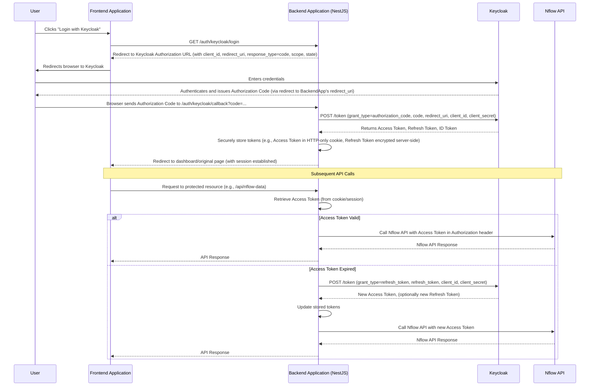

# Technical Specification: Keycloak SSO Integration for Nflow API

## 1. Introduction

This document provides the technical details for integrating Keycloak SSO with the web application to automate Nflow API token management. It covers the architecture, authentication flow, API endpoints, token handling, and Keycloak client configuration.

## 2. Goals

- To securely implement OAuth2 Authorization Code Flow with Keycloak.
- To automate access token retrieval and refresh for Nflow API calls.
- To define clear frontend and backend responsibilities.
- To ensure robust error handling and security best practices.

## 3. Architecture Overview

The integration will involve modifications to both the frontend and backend of the application.

- **Frontend:** Will handle user interaction for login initiation and redirecting to Keycloak. It will not directly handle or store tokens.
- **Backend (NestJS):** Will manage the OAuth2 flow (callback, token exchange, refresh), securely store tokens (e.g., in an HTTP-only cookie for the access token, and encrypted server-side storage for the refresh token), and attach the access token to Nflow API requests.

## 4. Authentication Flow Diagram (OAuth2 Authorization Code Flow)

## 5. Keycloak Client Setup Checklist

To enable this integration, a new client will need to be configured in the Nflow Keycloak realm. The Nflow team will provide this client or the necessary permissions to create it.

- **Client ID:** e.g., `nflow-assistant-app` (to be defined)
- **Client Protocol:** `openid-connect`
- **Access Type:** `confidential` (requires a client secret)
- **Standard Flow Enabled:** `ON` (Authorization Code Flow)
- **Implicit Flow Enabled:** `OFF`
- **Direct Access Grants Enabled:** `OFF`
- **Service Accounts Enabled:** `OFF` (unless a specific backend service needs to act on its own behalf, not typical for this user-facing flow)
- **Valid Redirect URIs:**
  - `YOUR_BACKEND_APP_URL/auth/keycloak/callback` (e.g., `http://localhost:3000/auth/keycloak/callback` for local dev, `https://<your-prod-app-url>/auth/keycloak/callback` for prod)
- **Web Origins:** `+` (add your frontend application URL to allow CORS if necessary for direct frontend-to-Keycloak interactions, though not primary in this flow for token exchange).
- **Admin URL:** (Optional, URL for managing the client in Keycloak admin console)
- **Base URL:** (Optional, application's base URL)
- **Client Authenticator:** `Client ID and Secret`
- **Mappers:** (Ensure standard OIDC mappers are present if specific claims like email, name are needed in the ID token or UserInfo endpoint)
  - `email`, `profile`, `openid` scopes should be requested.
- **Scope:** (Define any custom scopes if needed, typically `openid`, `email`, `profile` are sufficient initially).
- **Client Secret:** Will be generated by Keycloak and must be securely stored in the backend application's environment variables.

## 6. Backend Implementation (NestJS)

### 6.1. Modules and Services

- **`AuthModule`:** A new module to handle authentication logic.
  - `KeycloakStrategy` (using `passport-oauth2` or a dedicated Keycloak Passport strategy if available and suitable, or custom implementation).
  - `AuthController`: Exposes login, callback, logout, and potentially refresh token endpoints.
  - `AuthService`: Contains the core logic for token exchange, storage, and refresh.
  - `SessionSerializer` (if using sessions with Passport).
- **Configuration:** Keycloak settings (client ID, secret, auth URL, token URL, realm) will be managed via `ConfigModule` and environment variables.

### 6.2. API Endpoints

- **`GET /auth/keycloak/login`**
  - **Description:** Initiates the Keycloak login process.
  - **Action:** Generates the Keycloak authorization URL (including `client_id`, `redirect_uri`, `response_type=code`, `scope`, and a `state` parameter for CSRF protection) and redirects the user's browser to it.
  - **Security:** The `state` parameter should be generated, stored (e.g., in session or a short-lived cookie), and validated in the callback.
- **`GET /auth/keycloak/callback`**
  - **Description:** Keycloak redirects here after successful user authentication.
  - **Parameters (query):** `code` (authorization code), `state` (CSRF token).
  - **Action:**
    1.  Validate the `state` parameter against the one stored.
    2.  Exchange the `code` for an access token, refresh token, and ID token by making a POST request to Keycloak's token endpoint.
    3.  Securely store the tokens (see section 7).
    4.  Establish a session for the user (e.g., by setting an HTTP-only cookie containing the access token or a session ID).
    5.  Redirect the user to a designated frontend page (e.g., dashboard).
  - **Security:** HTTPS only. Validate `state` parameter.
- **`POST /auth/keycloak/refresh` (Protected or Internal)**
  - **Description:** Refreshes an expired access token using a refresh token.
  - **Action:**
    1.  Retrieve the refresh token from secure storage.
    2.  Make a POST request to Keycloak's token endpoint with `grant_type=refresh_token`.
    3.  Receive new access token (and potentially a new refresh token).
    4.  Update the stored tokens.
    5.  Return the new access token (or update the session/cookie).
  - **Security:** This endpoint should ideally be called internally by the backend when an Nflow API call fails due to an expired token, or proactively before expiration. If exposed to the frontend, it must be protected.
- **`POST /auth/keycloak/logout`**
  - **Description:** Logs the user out of the application.
  - **Action:**
    1.  Clear the stored tokens (access and refresh) from the backend storage and session/cookie.
    2.  Optionally, redirect the user to Keycloak's logout endpoint to terminate the Keycloak session (`end_session_endpoint` from OIDC discovery, with `id_token_hint` and `post_logout_redirect_uri`).
  - **Response:** Success message or redirect.

### 6.3. Nflow API Integration

- A service/interceptor will be responsible for attaching the access token to outgoing Nflow API requests.
- This service will retrieve the access token from its storage (e.g., session, HTTP-only cookie).
- It will handle 401 Unauthorized errors from Nflow API by attempting a token refresh if a refresh token is available.

## 7. Token Storage and Usage Strategy

- **Access Token:**
  - **Storage:** Store in a secure, HTTP-only cookie. This makes it automatically sent with requests to the backend and inaccessible to client-side JavaScript, mitigating XSS risks.
  - **Usage:** The backend reads the access token from the cookie to authenticate Nflow API calls.
  - **Alternative for SPA:** If a backend-for-frontend (BFF) pattern is used, the BFF can manage tokens and the frontend makes API calls to the BFF, which then proxies to Nflow with the token.
- **Refresh Token:**
  - **Storage:** Store server-side only. Options:
    - Encrypted in a database, associated with the user session.
    - In a secure server-side cache (like Redis) if appropriate TTLs are managed.
    - **Never send to the frontend or store in local storage/session storage.**
  - **Usage:** Used exclusively by the backend to obtain new access tokens from Keycloak.
- **ID Token:**
  - **Storage:** Can be stored temporarily if user profile information is needed immediately after login. Usually not stored long-term unless specific claims are continuously required and cannot be fetched otherwise.
  - **Usage:** Validate its signature and claims upon receipt. Can be used to extract user information (e.g., email, name).

### 7.1. Security Considerations for Tokens

- **CSRF Protection:** Use the `state` parameter in the OAuth2 flow. For backend API endpoints, ensure appropriate CSRF protection mechanisms are in place (e.g., NestJS CSRF protection if forms are involved, or stateless protection for APIs like checking Origin/Referer or using double-submit cookies if applicable).
- **HTTPS:** Enforce HTTPS for all communications.
- **Token Expiration:** Adhere to Keycloak's token expiration times. Access tokens are typically short-lived, refresh tokens are longer-lived.
- **Secrets Management:** Keycloak client secret and any encryption keys for refresh tokens must be stored securely (e.g., environment variables, secrets manager).

## 8. Frontend Implementation

- **Login Button:** A "Login with Keycloak" button/link.
- **Redirection:** Clicking the login button should make a request to the backend's `GET /auth/keycloak/login` endpoint, which will then handle the redirect to Keycloak.
- **Callback Handling:** The frontend doesn't directly handle the `/auth/keycloak/callback`. The browser is redirected there, the backend processes it, and then redirects the browser back to a designated frontend route (e.g., `/dashboard`).
- **Authenticated State:** The frontend needs to know if the user is authenticated. This can be managed by:
  - The presence of the session cookie established by the backend.
  - An API endpoint on the backend (e.g., `/auth/status`) that the frontend can call to check authentication status and get user info.
- **Logout Button:** Triggers a call to the backend's `POST /auth/keycloak/logout` endpoint.
- **API Calls:** All API calls requiring Nflow access will be made to the application's backend, which will then attach the Nflow access token and forward the request or perform the Nflow interaction.

## 9. Error Handling

- **Keycloak Unavailability:** Graceful error messages if Keycloak is down or unreachable.
- **Invalid Credentials:** Keycloak handles this; the user will not be redirected back with an auth code.
- **Token Exchange Failure:** Backend should log errors and potentially inform the user of a login issue.
- **Token Refresh Failure:** If refresh fails (e.g., refresh token revoked or expired), the user must re-authenticate. The backend should clear existing tokens and prompt for login.
- **Nflow API Errors:** Distinguish between Nflow API errors (e.g., bad request, permissions) and auth errors (401).

## 10. Environment Variables

Backend application will require the following environment variables:

- `KEYCLOAK_CLIENT_ID`: Client ID for the application in Keycloak.
- `KEYCLOAK_CLIENT_SECRET`: Client secret for the application.
- `KEYCLOAK_REALM`: Keycloak realm name.
- `KEYCLOAK_AUTH_SERVER_URL`: Base URL of the Keycloak server (e.g., `https://keycloak.example.com/auth`).
- `KEYCLOAK_CALLBACK_URL`: The full callback URL (e.g., `https://app.example.com/auth/keycloak/callback`).
- `NFLOW_API_URL`: Base URL of the Nflow API (already present).
- `SESSION_SECRET`: Secret for signing session cookies (if using `express-session`).
- `REFRESH_TOKEN_ENCRYPTION_KEY`: If refresh tokens are encrypted at rest.

## 11. Testing Strategy

- **Unit Tests:**
  - `AuthService` logic for token exchange, refresh, storage.
  - `KeycloakStrategy` (if custom or heavily configured).
  - Token attachment logic for Nflow API calls.
- **Integration Tests:**
  - Full login flow with a mock Keycloak server (e.g., using `nock` to mock HTTP calls to Keycloak).
  - Token refresh mechanism.
  - Protected Nflow API proxy endpoints.
- **End-to-End Tests (Manual initially, consider automation):**
  - Login via actual Keycloak dev/staging instance.
  - Access Nflow-dependent features.
  - Logout.
  - Session expiration and token refresh behavior.

---
